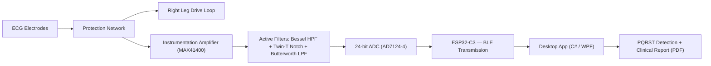

# CardioMed — Portable ECG Acquisition & Monitoring System

**Bachelor's Thesis · Technical University of Cluj-Napoca**
Faculty of Electronics, Telecommunications and Information Technology — 2026

A low-cost, single-lead ECG acquisition and monitoring system built around a **discrete analog front-end** instead of an integrated AFE chip — designed to meet the essential requirements of **IEC 60601-2-25** while staying affordable enough for continuous home use.

---

## Overview

Clinical-grade electrocardiographs remain largely confined to hospitals due to their cost and complexity. CardioMed explores an alternative: a fully discrete analog signal chain — individually optimized filter stages, an instrumentation amplifier, and an active common-mode rejection loop — paired with a companion desktop application that detects heartbeats in real time and generates clinical reports automatically.

Every design decision, from a single capacitor value to the ADC sample rate, is traced back to a specific requirement of the medical standard — a principle referred to throughout the project as **vertical traceability**.

## Key Results

| Parameter | Standard Requirement (IEC 60601-2-25) | Achieved |
|---|---|---|
| Input-referred noise | ≤ 30 µV p-p | **10.76 µV** |
| Passband | 50 mHz – 150 Hz | 49.67 mHz – 150.71 Hz |
| System CMRR | ≥ 89 dB | **123 – 137 dB** |
| Defibrillation protection | ≥ 5000 V | 5000 V |
| Patient fault current | ≤ 10 µA | **3.3 µA** |
| R-wave detection sensitivity (MIT-BIH) | — | **91.5%** |
| Unit cost (BOM, 1,000 units) | — | **~130 RON** |

## System Architecture



- **Analog front-end** — two-stage TVS/Zener input protection, a Right Leg Drive loop for active common-mode cancellation, a MAX41400 instrumentation amplifier, and a cascade of Bessel high-pass, Twin-T notch, and Butterworth low-pass active filters.
- **Digitization & wireless link** — 24-bit AD7124-4 ADC feeding an ESP32-C3, streaming digitized ECG samples over Bluetooth Low Energy.
- **PCB** — compact 4-layer board (82×46 mm) designed in KiCad, with physically separated analog and digital domains and length-matched differential input traces.
- **Desktop application** — a C#/WPF app performing real-time PQRST detection (Pan–Tompkins-derived algorithm), computing 7 clinical parameters (heart rate, PR/QRS/QTc intervals, SDNN, R-wave amplitude, ectopic-beat count), and auto-generating signed PDF reports.
- **Validation** — the full analog chain was validated in LTSpice against a real ECG signal (MIT-BIH Normal Sinus Rhythm Database) with a realistic interference model; the detection algorithms were separately validated against the public MIT-BIH Arrhythmia and QT Databases (PhysioNet).

## Repository Structure

```
├── AchizitionareSemnal/         # Signal acquisition & analysis
├── Documentatie/                # Full thesis document & synthesis
├── ESP32BLE+InterfataDigitala/  # ESP32-C3 firmware, BLE link, and the C#/WPF monitoring app
├── PCB_REVC/                    # KiCad schematic, PCB layout, and Gerbers
├── SimulariLtspice/             # LTSpice simulations of the analog chain
├── SSET/                        # Student symposium presentation materials
└── Licenta_EA_TST_2024-2025/    # Project archive
```

## Tools & Technologies

`LTspice` · `KiCad` · `Embedded C` · `Python` · `C# / WPF` · `Bluetooth Low Energy` · `MIT-BIH / PhysioNet datasets`

## Standards

Designed against **IEC 60601-2-25** (electrocardiograph performance) and **IEC 60601-1** (basic electrical safety).

## Author

**Bota Andrei-Daniel** — Applied Electronics, Technical University of Cluj-Napoca
[GitHub](https://github.com/BotaAndreiD) · [LinkedIn](https://www.linkedin.com/in/andrei-bota-283269297/)

## Acknowledgments

Thanks to my thesis advisor and to Analog Devices, where an earlier internship shaped much of the analog design approach used in this project.
